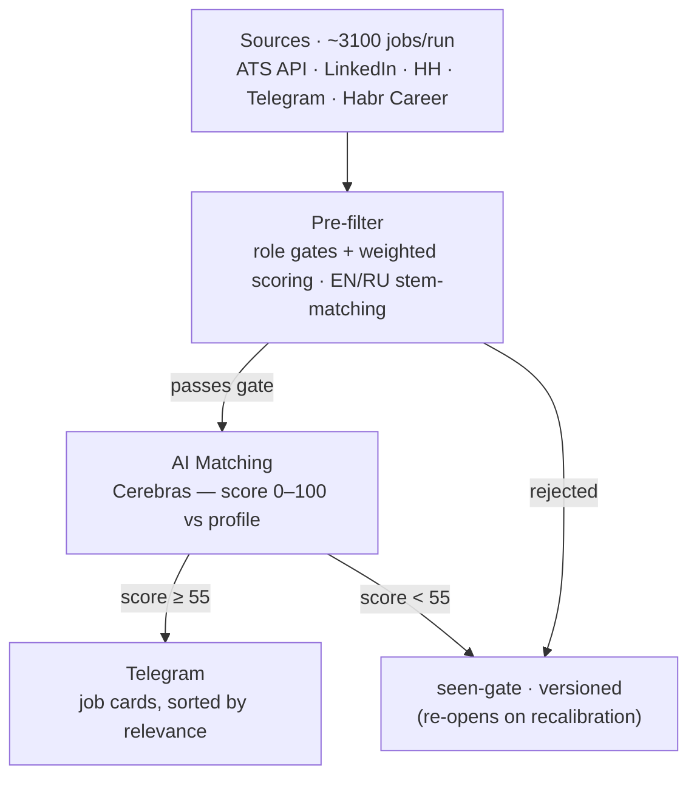

# Job Hunter Bot 🤖


Automated job search system for Web3/DeFi operations roles. Parses ~3100 vacancies from 11 sources twice a day, filters them down with a two-stage pipeline, and sends the survivors to Telegram. Running in production since June 2026.

## ✨ Highlights

- **Production 24/7** — 11 sources → pre-filter → AI scoring against a candidate profile → job cards in Telegram, on a VPS.
- **Parser composition** — public ATS APIs (Greenhouse / Lever / Ashby) + LinkedIn guest API + HH.ru + 13 Telegram channels, unified behind one interface.
- **EN/RU keyword engine** — stem-matching pre-filter (role gates + weighted scoring) that ranks Russian and English vacancies equally.
- **AI matching** — Cerebras with a weighted model, human-readable reasons, and a versioned "seen" gate that re-opens jobs on recalibration.
- **Every tuning decision is measured, not guessed** — see [Decisions made by measurement](#decisions-made-by-measurement) below. A/B on a frozen batch runs before every threshold change.

## How it works



Full data flow, plus the reasoning behind each architectural choice (why two filter
stages, why SQLite, why polling not a webhook, etc.) — see [docs/ARCHITECTURE.md](docs/ARCHITECTURE.md).

## The funnel in numbers

Measured on production, 8–15 August 2026 (16 scheduled runs):

```
~3 145 vacancies fetched per run
       ↓  seen-gate — most were already processed on an earlier run
   4 651 new over 8 days
       ↓  pre-filter          −96.5%
     165 reached the AI stage        (3.5%)
       ↓  AI score ≥ 55       −41%
      98 delivered to Telegram       ≈ 12 per day
```

A single fresh batch scored end-to-end with the seen-gate disabled (3 420 vacancies)
shows where the pre-filter actually spends its cuts. Counts below are from the
3 133-vacancy batch measured before the HH second pass landed; the proportions did
not shift:

| Rejection reason | Vacancies |
|---|---|
| no role keywords (wrong function) | 536 |
| requires 7+ years of experience | 284 |
| hard-exclude: `software engineer` | 270 |
| requires a language other than RU/EN | 267 |
| dev role with no QA/ops/support context | 258 |
| no crypto context **and** no role keywords | 252 |
| executive/dev/finance title | 154 |
| requires fluent English | 92 |
| requires spoken English | 71 |

**The finding that changed priorities:** the English barrier costs 163 of 3 133
vacancies — **5.2%**. Three iterations had gone into the English gate on the
assumption that it was the main constraint. The measurement says otherwise: "wrong
function" (536 + 252 = 788) cuts five times deeper. The gate work was still correct —
irrelevant vacancies were reaching Telegram — but it was never the bottleneck.

Reproduce it yourself: `python tools/diag/funnel_check.py`.

## Sources

| Source | Type | Scope | Jobs/run |
|--------|------|-------|----------|
| Greenhouse API | ATS | 18 companies (OKX, Coinbase, Ripple, Gemini, Fireblocks, Bitpanda, BitGo, Luno, Nansen, …) | 1060 |
| HH.ru | RSS | ~40 RU/EN queries (crypto ops/support/QA, AML/ЦФА, AI automation) | 522 |
| Lever API | ATS | 10 companies (Binance, Anchorage, MoonPay, Safe, Gate.io, Merkle Science, …) | 417 |
| LinkedIn | guest API | 11 relocation countries by `geoId` | 400 |
| Ashby API | ATS | 11 companies (Kraken, Ledger, Trust Wallet, Polymarket, Elliptic, Notabene, …) | 282 |
| Telegram | t.me/s/ scraping | 13 channels | 236 |
| RemoteOK | JSON API | all remote | 100 |
| LaborX, CryptoJobsList, Remote3 | Web scraping | crypto boards | 83 |
| Habr Career | Web scraping | RU crypto/fintech | 33 |

> Counts are from a live run on 2026-08-15, not estimates.
>
> **LinkedIn** replaced JobSpy in August 2026. JobSpy geocodes the location string and validates it against its own country list — it crashes with `Invalid country string` on Kazakhstan, Serbia and Armenia, and reads "Georgia" as the US state. The guest endpoint takes a numeric `geoId` instead, so a country is unambiguous. Every `geoId` in `settings.yaml` was verified by querying it and reading back the locations it actually returned. The rate limit the old code worried about turned out to be stale: a live probe returned 551 vacancies with zero HTTP 429.
>
> web3career is disabled (HTTP 403).

## AI Matching

Each job is scored against the candidate profile (resume + skills + preferences) using **Cerebras** inference (gpt-oss-120b model). Batch processing: 5 jobs per request.

Scoring:
- **90–100** — perfect match
- **75–89** — strong match, 1–2 minor gaps
- **55–74** — decent match, worth applying
- **< 55** — not sent (below the notification threshold)

Checkpoint saved after every batch → safe to restart mid-run without re-processing.

## Pre-filter rules

Two-layer filtering before AI matching (`config/criteria.yaml`):

**Hard gate** (instant exclude):
- C-level / founder / president titles
- Pure dev roles (Solidity, smart contracts, backend/frontend coding)
- Non-Russian/English language requirements

**Weighted score** (0–100) — soft penalties, lower the score but don't exclude:
- Director / Head / VP / Lead / Principal titles
- Fluent/Native/C1/C2 English requirement (penalty weight varies by role)
- 6+ years experience requirement

Only jobs that pass the gate **and** clear the role's threshold go to AI matching.

## Decisions made by measurement

Every number below came from a measurement that contradicted the intuition behind it.
This is the part of the project I'd actually defend in an interview.

**The notification threshold was too high, and lowering it was not a guess.**
Started at 65. Dropping it to 58, then to 55, was done by replaying history: the
55–57 band alone contained **113 relevant vacancies** (Treasury/DeFi ops, CEX/DEX,
support) that the AI had already approved and the threshold had silently discarded.

**A penalty that looked reasonable turned out to be a no-op.**
When written-only English was downgraded from a hard cut to a soft penalty, `-8`
felt right. An A/B on a frozen batch showed it let through **zero** vacancies —
every candidate landed just under the role threshold of 42 (Nansen scored 38).
Measured 0 / −4 / −8 and shipped **−4**. Rule that came out of it: calibrate
penalties by measurement, never by feel.

**One batch of six vacancies exposed six independent bugs.**
Triaging complaints one at a time had produced three wrong guesses in a row. Batching
six "why was this sent to me" cases surfaced six *different* causes of the same
symptom — among them `\bverbal\b` failing to match "verbally", and `re.finditer`
returning non-overlapping matches, so "fluent russian and english" consumed the token
that the B2-level check needed. Diagnosis now starts by instrumenting which branch
fired, not by editing the regex.

**A source was capped and nobody had checked.**
HH.ru is read over RSS, which hard-caps at **20 vacancies per query** — pagination is
silently ignored (`&page=1,2,3` all return the same first ID), and `per_page` was a
dead parameter. Nearly every query was sitting on that ceiling. Since the parser
already sorted by date, the fix was a *second* pass sorted by relevance, which returns
a different slice of the same query. Measured on all 45 queries: 530 → **+333 new
(+63%)**. The pass is skipped for queries that returned fewer than 20 results — those
are not truncated, and all 18 of them yielded exactly zero.

End to end on a full batch: 3 133 → **3 420** vacancies, and 243 → **279** clearing
the pre-filter threshold.

**The obvious companion change turned out to be worthless.**
If the ceiling was hiding AI-automation roles, adding the exact market job titles
(`AI-интегратор`, `внедрение ИИ`, `AI Automation Engineer`, and six more) should help.
Measured: **+113 raw vacancies, +2 through the gate** — and both were sales roles.
The `AI Automation Engineer` postings did show up, but they came from the *second
pass* on existing queries. They had always been findable; the 20-vacancy ceiling was
cutting them off. The queries were reverted and the negative result written into
`settings.yaml` so it does not get re-tried.

**Deduplication ran one stage too late.**
Near-duplicates (the same role posted under several `geoId`s, or titles differing only
by a double space) were collapsed just before sending — so Telegram never showed
copies, but every copy had already consumed its own slice of the Cerebras budget.
Moving the collapse ahead of the AI call removes **34 of 279 candidates (12%)** on a
full batch.

**Measuring the pipeline is what found the security bug.**
Reading the log to build the funnel above revealed that `httpx` logs request URLs at
INFO — and the Telegram bot token lives *inside* the URL (`/bot<TOKEN>/getUpdates`).
With polling every 10 seconds, the token was written to disk roughly 8 600 times a
day, into a file that had no rotation and had reached 64 MB. Noisy loggers are now
pinned to WARNING and the handler rotates at 5 MB × 3.

## Telegram notification format

```
🎯 Crypto Operations Manager
Binance  ·  Remote  ·  💰 3000–5000 USDT

──────────────────────

✅ Почему подходит
· Опыт с CEX/DEX операциями — прямое совпадение
· Знание инструментов Binance и OKX

──────────────────────

⚠️ Учесть
· Упоминаются обязанности тимлида

──────────────────────

💬 Укажи опыт торговых операций на CEX и мониторинга on-chain активности.

──────────────────────

87/100  ·  cryptojobslist.com
```

## Setup

**1. Clone and install**
```bash
git clone https://github.com/Aleksandr-Sit/job-hunter.git
cd job-hunter
pip install -r requirements.txt
```

**2. Configure**
```bash
cp .env.example .env
# Edit .env — add your API keys
```

Required keys in `.env`:
```env
CEREBRAS_API_KEY=csk-...        # inference.cerebras.ai — free, no card
CEREBRAS_MODEL=gpt-oss-120b

TELEGRAM_BOT_TOKEN=...          # @BotFather
TELEGRAM_CHAT_ID=...            # @userinfobot

# Optional: HH.ru works without keys (public RSS)
```

**3. Edit your profile**

- `config/profile/resume.md` — your resume
- `config/profile/skills.json` — skills and levels
- `config/profile/preferences.json` — target roles, salary, stack

**4a. Run natively**
```bash
python -m src.scheduler
```

**4b. Run with Docker**
```bash
docker compose up -d
docker compose logs -f   # watch logs
```

> **Important — switching from native to Docker:** If you previously ran the bot natively, SQLite may have left `data/jobs.db-wal` and `data/jobs.db-shm` files. These cause a `disk I/O error` inside Docker. Before the first `docker compose up`, stop any running Python processes and delete those two files if they exist.

Runs twice a day on cron (`0 6,14 * * *` UTC). Restarts automatically on failure (`restart: unless-stopped`).

## Deploy to VPS (recommended)

Running on a VPS means the bot works 24/7 without your PC being on.

**Requirements:** Ubuntu 22.04+, Docker, SSH access.

```bash
# 1. Install Docker on server
curl -fsSL https://get.docker.com | sh && systemctl enable docker

# 2. Clone repo
git clone https://github.com/Aleksandr-Sit/job-hunter.git /opt/job-hunter
mkdir -p /opt/job-hunter/data/logs

# 3. Copy secrets from local machine (run in local PowerShell)
scp -i "~/.ssh/your_key" .env root@<SERVER_IP>:/opt/job-hunter/
scp -i "~/.ssh/your_key" data/jobs.db root@<SERVER_IP>:/opt/job-hunter/data/

# 4. Start
cd /opt/job-hunter && chmod 600 .env && docker compose up -d --build
```

After deploy the container restarts automatically on server reboot (`restart: unless-stopped`).

## Project structure

```
job-hunter/
├── PROFILE.md                 # master candidate profile (local only — gitignored)
├── CLAUDE.md                  # project rules for AI-assisted dev
├── config/
│   ├── settings.yaml          # intervals, threshold, sources
│   ├── sources.yaml           # Telegram channels, job boards
│   ├── criteria.yaml          # role-scoring criteria (weights, keywords)
│   └── profile/               # your resume, skills, preferences
├── src/
│   ├── parsers/                # HH.ru, Telegram, Greenhouse, Lever, Ashby, LinkedIn, web boards
│   │   └── normalize.py        # single source of truth for remote/office detection
│   ├── matcher/
│   │   ├── cerebras_matcher.py # Cerebras AI batch matching
│   │   └── pre_filter.py      # gate + weighted scoring before AI
│   ├── bot/
│   │   ├── notifier.py         # sends messages, builds keyboard
│   │   └── callback_handler.py # polling listener for the "Пропустить" button
│   ├── storage.py              # SQLite: dedup + match cache
│   └── scheduler.py            # APScheduler main loop
├── docs/
│   ├── ARCHITECTURE.md         # data flow + design decisions
│   └── ...                     # reference docs, target criteria, audit report
├── data/                       # SQLite DB, logs, match checkpoints (gitignored)
├── .env.example
└── requirements.txt
```

## Tech stack

- **Python 3.11+**
- **Cerebras** — LLM inference (free tier, gpt-oss-120b)
- **APScheduler** — job scheduling
- **python-telegram-bot** — Telegram notifications
- **BeautifulSoup4 + requests** — web scraping
- **SQLite** — dedup and match result cache
- **pytest + ruff + GitHub Actions** — 179 tests, linting, CI on every push
